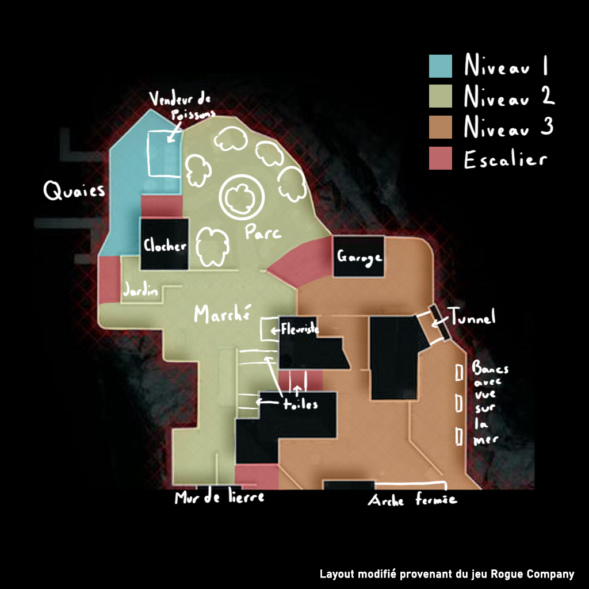
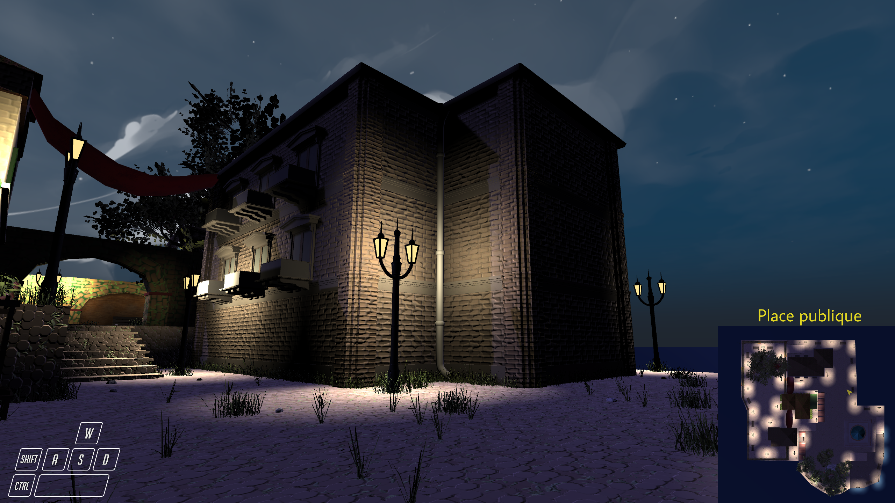
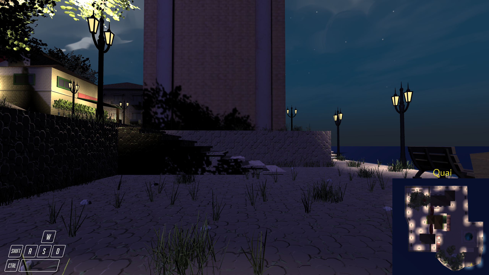

# DJV5530 - Game Jam

## Quelques mots...

Bienvenue à notre projet. Voici quelques captures d'écrans de notre projet. 

Nous sommes l'équipe N dans le cadre du game jam du cours DJV5530, à la session automne 2020. Les membres de l'équipe sont: Tchun-Kheung-Ng Chao, Ludovic Descary, Antoine Gaumond et Marie-Michelle Poitras.

Un lien au build est fourni ci-dessous. 

### Installation
1. Télécharger le [fichier ZIP](https://drive.google.com/file/d/1BqCHxSPN13Te9PVDdjQvlZgG3tHLJtZK/view?usp=sharing) stocké sur mon Google Drive
2. Dézipper le fichier.
3. Ouvrir MapCompetitive.exe

## Captures d'écrans

Cette image est le plan de niveau, qui tient sa base de la map Windward du jeu Rogue Company. 

Le design du niveau a été basé sur une île d'Italie la nuit. Nous avons opté pour une architecture ancienne tranquillement envahie par la végétation. Le son du vent plonge le joueur dans l'atmosphère pittoresque d'une petite ville la nuit.

### Vue du parc

### Vue des marchés, à la place publique

### Vue sur les batîments

### Vue (partiellement cachée) sur le clocher, à partir des résidences

### Vue sur le clocher et les alentours, à partir de la place publique

### Vue sur l'appartement

### Un grand arbre résidence à la place publique des résidences

### Il ne manque pas de variétés de plantes au fleuriste.

### Voilà! 

Je vous recommande fortement d'explorer par vous-même, l'expérience en vaut le coup! Certains éléments crucials à l'atmosphère (comme le son ou le mouvement) ne peuvent pas être transmis par image :)

P.S.: Il y a 2185 herbes placés sur le niveau.

